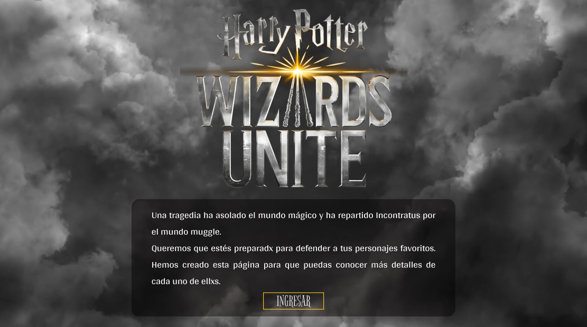
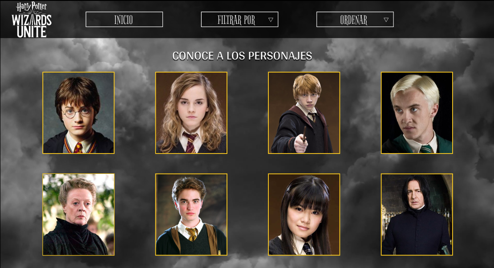
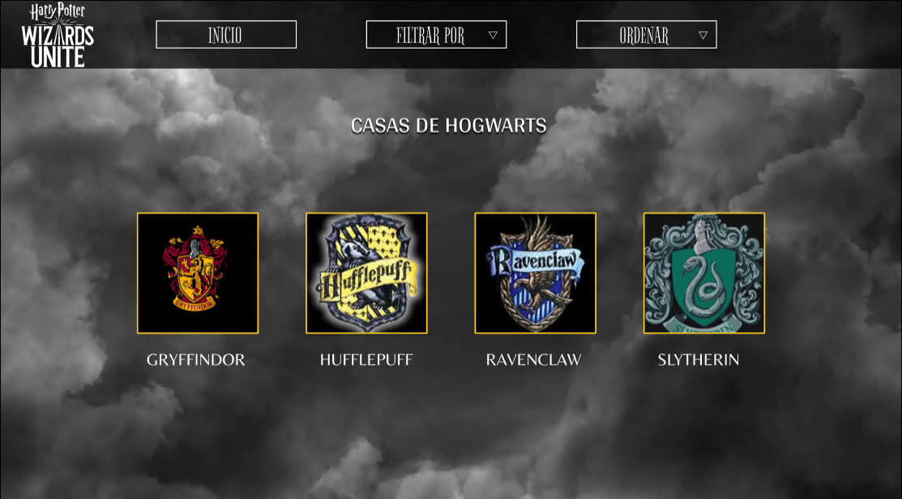
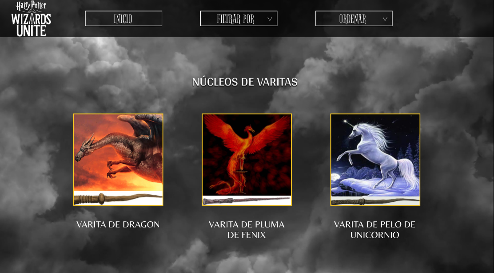
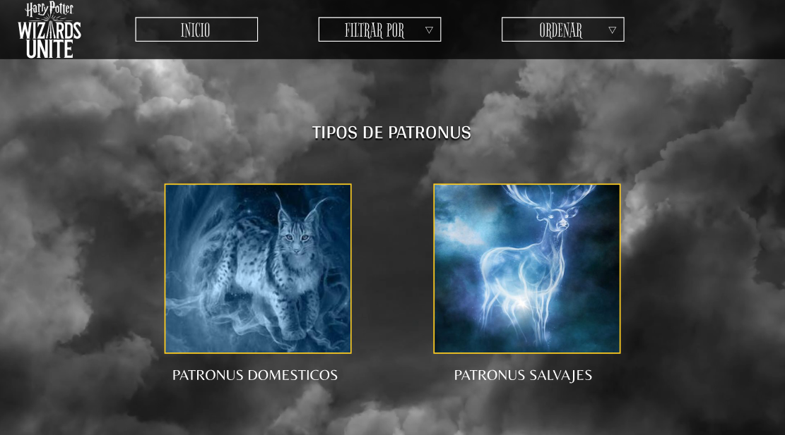
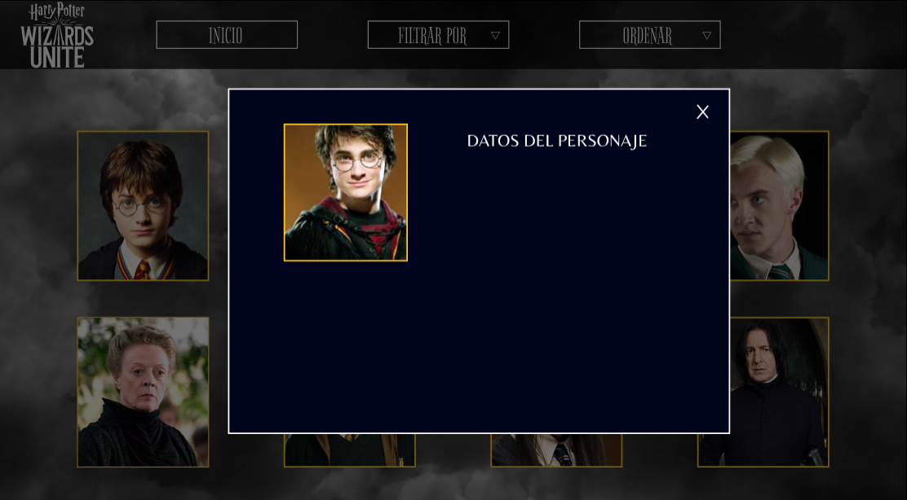

# Data Lovers

## Índice

* [1. Resumen del proyecto](#1-resumen-del-proyecto)
* [2. Objetivos de la web](#2-objetivos-de-la-web)
* [3. Planificación del proyecto](#3-planificación-del-proyecto)
* [3.1 Historias de usuario](#3.1-Historias-de-usuario)
* [4. Diseño de la Interfaz de Usuario](#4-Diseño-de-la-Interfaz-de-Usuario)
* [4.1 Prototipo de baja fidelidad](#4.1-Prototipo-de-baja-fidelidad)
* [4.2 Prototipo de alta fidelidad](#4.2-Prototipo-de-alta-fidelidad)
* [5. Implementación de la Interfaz de Usuario (HTML/CSS/JS)](#5-Implementación-de-la-Interfaz-de-Usuario-HTML/CSS/JS)
* [6. Objetivos de aprendizaje Data Lovers](#6-Objetivos-de-aprendizaje-Data-Lovers)

***

## 1. Resumen del proyecto
En este proyecto se creó una web responsive pensada en todas las personas que estén interesadas en pertenecer al mundo Wizards Unite. En ella podrán encontrar datos valiosos de los personajes del juego, también podrán filtrar a los personajes de acuerdo a su preferencia, como por casa o varitas, y ordenar alfabeticamente para poder encontrar a su personaje deseado con mayor facilidad.

## 2. Objetivos de las web
- Conocer la funcionalidad de la web.
- Visualizar las características específicas de cada personaje a través de tarjetas.
- Ordenar alfabéticamente a los personajes.
- Conocer datos generales sobre las casas, núcleos de varitas y patronus.
- Filtrar los personajes según casa, varita y patronus.

## 3. Planificación del proyecto
Se comenzó leyendo los requisitos del proyecto, seguido de la organización como dupla para la realización de historias de usuario, prototipos de baja y alta fidelidad y pruebas con usuarios que nos dieron las pautas para mejorar el prototipo.

### 3.1 Historias de usuario

Las historias de usuario fueron el punto de partida para iniciar el proyecto. En un inicio se realizaron seis historias en papel y se desarrollaron más a detalle tres de ellas.
 

Luego se utilizo los tableros en Trello para poder hacer las modificaciones necesarias de manera más práctica y asi mantener el conecto entre la dupla.
Tablero Trello: https://trello.com/b/vqmL2UTM/data-lovers

## 4. Diseño de la Interfaz de Usuario

### 4.1 Prototipo de baja fidelidad

Al tener las historias de usuario concluidas se crearon bocetos en papel, con pequeños detalles que fueron cambiando para mejorar la experiencia del usuario. Con estos bocetos se testeo en equipo y se realizo feedback con otras personas para así llegar al prototipo de alta fidelidad.
Los principales comentarios que surgieron de este prototipo fueron importantes para mejorar el proyecto:
- Las personas prefieren no registrarse si no reciben nada a cambio.
- La web dio la impresión que se podia jugar el juego Wizards Unite.
- Desean tener más información como las características de las casas y núcleos de varitas.

En base a estos comentarios se mejoró el prototipo quedando de la siguiente manera:

También al ser un requisito el hacer una web responsive realizamos un prototipo de baja fidelidad de un posible uso en celular

### 4.2 Prototipo de alta fidelidad

 Ya realizado el prototipo en baja fidelidad, con claridad de la web que se crearia, se realizó un prototipo de alta fidelidad en Figma añadiendo las mejoras planteadas por los usuarios que vieron el prototipo de baja fidelidad.

También realizamos en Figma el prototipo para celular

## 5. Implementación de la Interfaz de Usuario (HTML/CSS/JS)

Luego de diseñar la interfaz de usuario trabajamos en la implementacion y realizamos los test unitarios correspondientes.

## 6. Objetivos de aprendizaje Data Lovers
​
A continuación te presentamos los objetivos de aprendizaje de este proyecto. Reflexiona y luego marca los objetivos que has llegado a **entender** y **aplicar** en tu proyecto.
​
### UX
​
- [x] Diseñar la aplicación pensando y entendiendo al usuario.
- [x] Crear prototipos para obtener feedback e iterar.
- [x] Aplicar los principios de diseño visual (contraste, alineación, jerarquía).
​
### HTML y CSS
​
- [ ] Uso correcto de HTML semántico.
- [x] Uso de selectores de CSS.
- [x] Construir tu aplicación respetando el diseño realizado (maquetación).
​
### DOM
​
- [x] Uso de selectores del DOM.
- [x] Manejo de eventos del DOM.
- [x] Manipulación dinámica del DOM.
​
### Javascript
​
- [x] Manipulación de strings.
- [ ] Uso de condicionales (if-else | switch).
- [ ] Uso de bucles (for | do-while).	
- [x] Uso de funciones (parámetros | argumentos | valor de retorno).
- [x] Declaración correcta de variables (const & let).
​
### Testing
- [ ] Testeo de tus funciones.
​
### Git y GitHub
- [x] Comandos de git (add | commit | pull | status | push).
- [x] Manejo de repositorios de GitHub (clone | fork | gh-pages).
​
### Buenas prácticas de desarrollo
- [ ] Uso de identificadores descriptivos (Nomenclatura | Semántica).
- [x] Uso de linter para seguir buenas prácticas (ESLINT).
